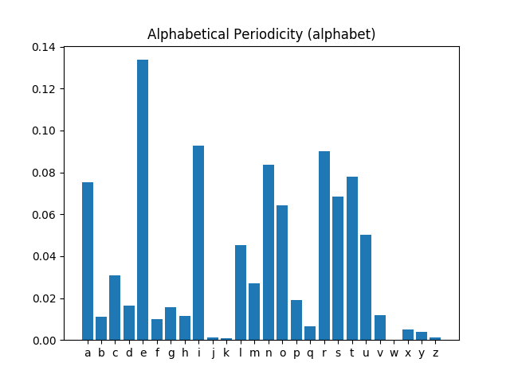
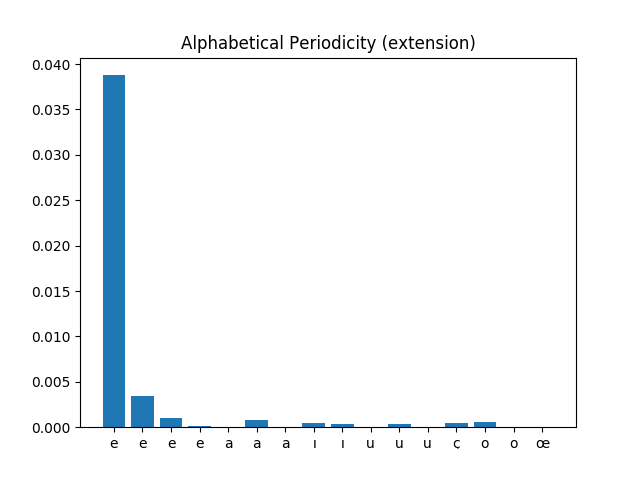
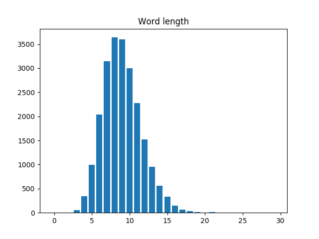
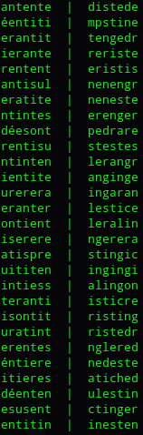

# Lingua
## Language analyzer and word generator

This python algorithm has been created to analyze language characteristics: length of the words, letter appearance frequencies and letter appearance probability matrices. Alongside of it is a word generator using those analyses to create language-like words.

### Credits
- https://github.com/dwyl for the english dictionnary used for testing
- https://www.freelang.com/dictionnaire/dic-francais.php for the french dictionnary used for testing
